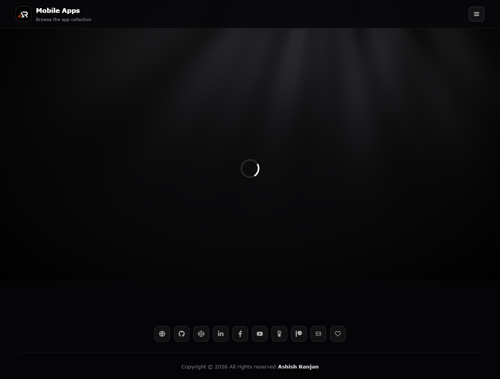

# Mobile Apps Distribution Page

A responsive React catalog for browsing Android applications, reading app details, viewing previews, and opening APK release links.

## Features

- Search and filter apps by category.
- Paginated app cards with icons, previews, versions, and platform details.
- Preview modal with keyboard and outside-click support.
- Share links and direct release downloads.
- Fixed branded header, mobile menu, icon-only footer links, and go-to-top control.

## Tech Stack

React, Vite, React Router, Styled Components, React Icons, and the Fetch API.

## Run locally

```bash
npm install
npm run dev
```

## Build and deploy

```bash
npm run lint
npm run build
npm run deploy
```

App data is stored in `public/data/apps.json`. App icons and previews are stored in `public/apps/`.

## Screenshot



## Links

- Portfolio: [https://www.ashishranjan.net/](https://www.ashishranjan.net/)
- GitHub: [https://github.com/a2rp](https://github.com/a2rp)
- CodePen: [https://codepen.io/ash1198](https://codepen.io/ash1198)
- LinkedIn: [https://www.linkedin.com/in/aashishranjan](https://www.linkedin.com/in/aashishranjan)
- Facebook: [https://www.facebook.com/theash.ashish/](https://www.facebook.com/theash.ashish/)
- YouTube: [https://www.youtube.com/@ashishranjan-ashz?sub_confirmation=1](https://www.youtube.com/@ashishranjan-ashz?sub_confirmation=1)
- Email: [ash.ranjan09@gmail.com](mailto:ash.ranjan09@gmail.com)

## Support

- Support: [https://a2rp-donation-page.netlify.app/](https://a2rp-donation-page.netlify.app/)
- Buy Me a Coffee: [https://buymeacoffee.com/a2rp](https://buymeacoffee.com/a2rp)
- Patreon: [https://patreon.com/a2rp](https://patreon.com/a2rp)